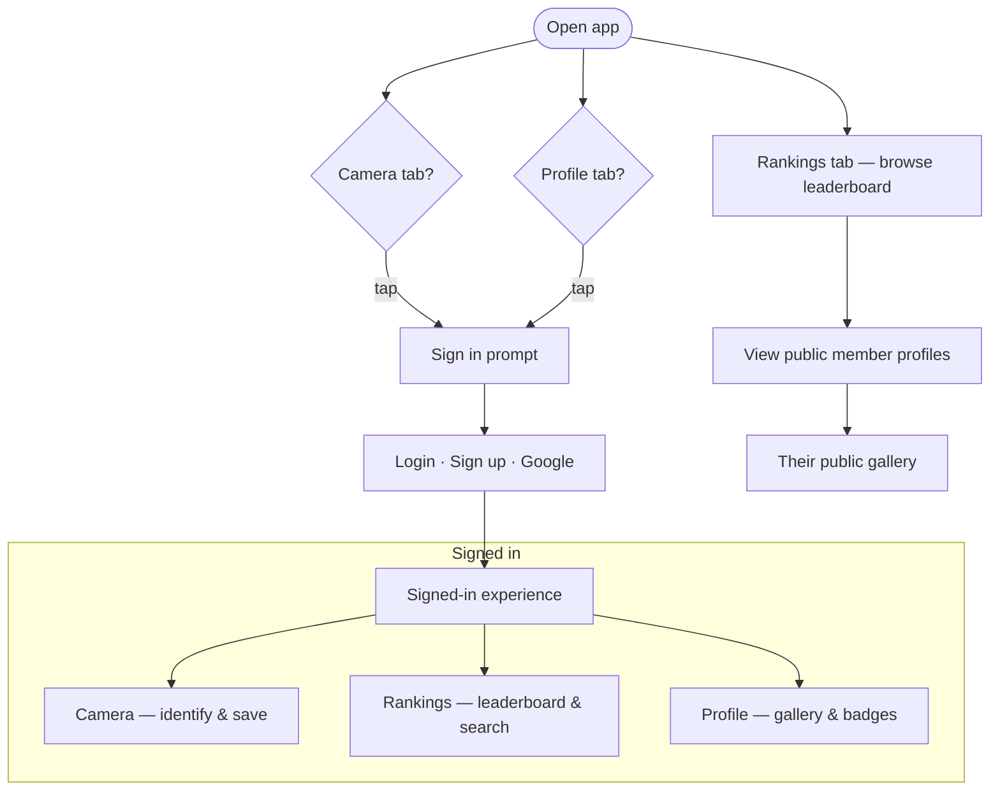
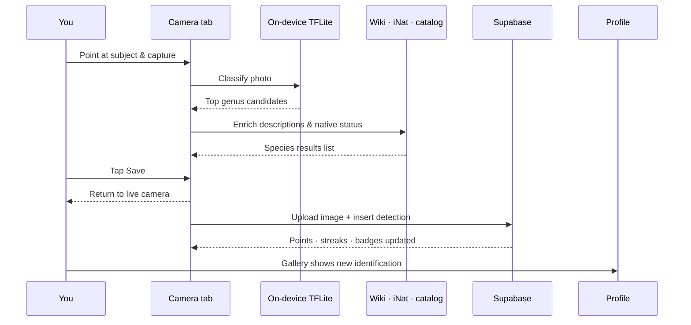
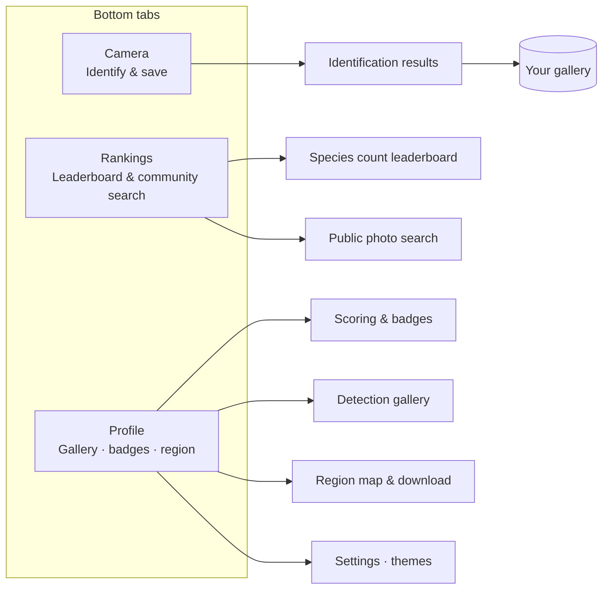
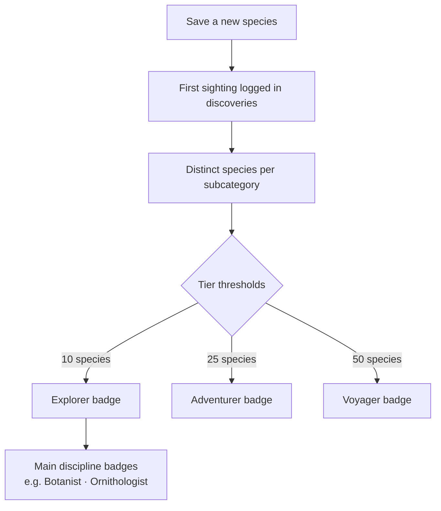
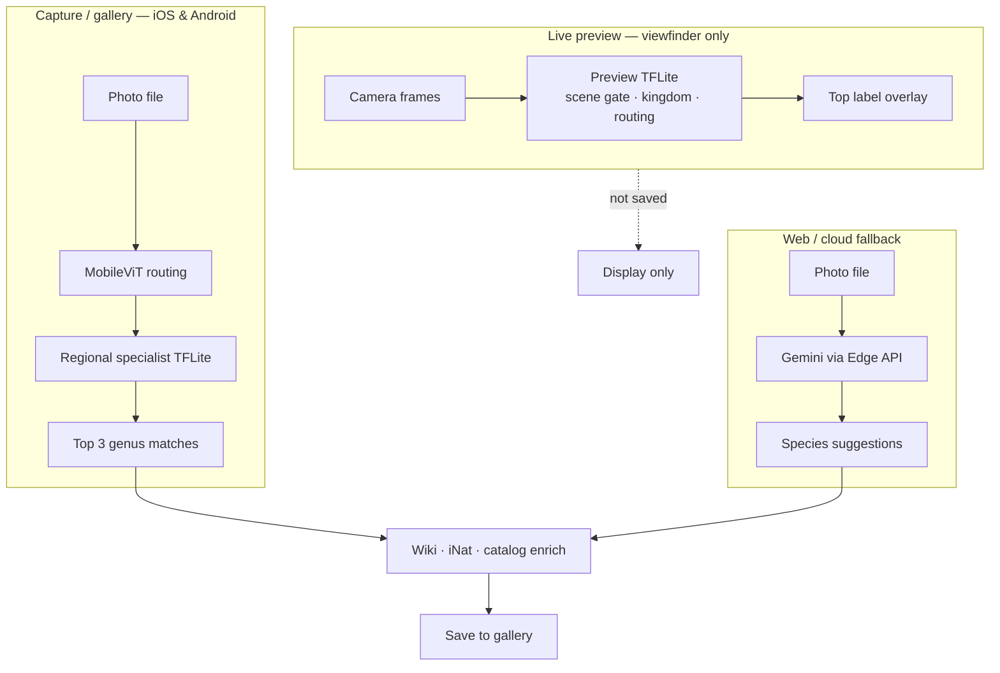

# Near Nature

A mobile nature-identification app built with **Expo**, **Supabase**, and on-device **TensorFlow Lite**. Point your camera at plants and wildlife, get genus-level suggestions enriched with Wikipedia and iNaturalist data, save discoveries to your gallery, and climb naturalist badges and community rankings.

---

## Features

### Camera & identification

- **Live preview inference** — optional on-device classifier on the viewfinder (scene gate, kingdom, or routing preview models); frame-sampled, not saved.
- **Capture or gallery pick** → on-device **TFLite** cascade on iOS/Android (MobileViT routing → regional specialist models → top genus candidates).
- **Web fallback** via Supabase Edge `identify-species` (Gemini vision) when TFLite is unavailable.
- **Enrichment waterfall** per candidate: saved detection → local species catalog → Wikipedia cache → live Wikipedia; iNaturalist native status for the primary match.
- **Background save** — UI returns to the camera immediately while upload and DB insert finish.

### Profile, gallery & scoring

- **Personal gallery** with grid/list layouts, search, and category filters.
- **Naturalist badges** — Explorer / Adventurer / Voyager tiers per discipline and subcategory (botanist, ornithologist, herpetologist, mammalogist, etc.).
- **Points & streaks** from saved identifications; first-species discovery bonus.
- **Collapsible scoring section** with discipline popovers and earned-badge tiles.
- **Public member profiles** — view another explorer’s gallery, stats, and badges.

### Explorer Board (Rankings tab)

- **Leaderboard** by native-species discovery count (paginated RPC).
- **Community search** — photo grid across public identifications when the search field is active.
- **Stale-while-revalidate** caching for instant open, background refresh.

### Regional modularity

- **Four US Census regions** — South (live), Northeast, Midwest, West (coming soon).
- **Region picker** on Profile with an interactive US map; home state drives default region.
- **On-demand model bundles** — specialist TFLite weights download per region from Supabase Storage (slim APK ships preview models only).

### Appearance & settings

- **Themes** — Dark, Light, and Light forest (Settings → Appearance).
- **Account** — email/username login, Google OAuth, profile motto, home state, avatar upload.
- **Identification feedback** (opt-in, dev builds) — optional ML telemetry and misclassification review when `EXPO_PUBLIC_CLASSIFICATION_DEBUG=1`.

### Offline-friendly caches

- **SQLite** on device for profile, gallery metadata, scoring snapshot, species catalog, Wikipedia cache, and Explorer Board pages.
- **Signed URLs** for private detection images in Supabase Storage.

---

## How to use the app

### Guest vs signed in



### Identify and save (happy path)



### Main tabs



### Badge progress (naturalist disciplines)



### Image inference

Three inference paths — only **capture** and **cloud** results can be saved.



| Path | Runs when | Models | Saved? |
|------|-----------|--------|--------|
| Live preview | Camera open, AI toggle on | `assets/tflite/preview_models/*` | No |
| Capture TFLite | Shutter or gallery pick | MobileViT + regional `inat2021_specialists_v2` | After Save |
| Cloud Gemini | Web, or no on-device model | `identify-species` edge function | After Save |

See [`docs/ARCHITECTURE.md`](./docs/ARCHITECTURE.md#image-inference) for cascade diagrams, regional model loading, and debug telemetry.

---

## Get started (development)

### Prerequisites

- Node.js 20+
- [Android Studio](https://developer.android.com/studio) (physical ARM device or emulator) for native builds
- A Supabase project — copy `.env.example` → `.env` and fill `EXPO_PUBLIC_SUPABASE_URL` and `EXPO_PUBLIC_SUPABASE_ANON_KEY`

### Install & run

```bash
npm install
npm run start:dev          # Metro + dev client (LAN)
npm run android:install    # Build & install on connected device
```

Other useful scripts:

| Script | Purpose |
|--------|---------|
| `npm run typecheck` | TypeScript |
| `npm run test` | Vitest unit tests |
| `npm run verify:supabase` | Smoke-test RPCs against your Supabase project |
| `npm run android:preview-apk` | Release APK with preview TFLite models only |
| `npm run seed:florida-parks` | Upsert Florida state parks into Supabase |
| `npm run setup:ml-telemetry` | Print ML telemetry SQL order + verify |

### Supabase setup

Run SQL scripts in the order documented in [`sql/README.md`](./sql/README.md), then reload the schema cache and run `npm run verify:supabase`.

Deploy the `identify-species` edge function and set `GEMINI_API_KEY` for web identification.

### Local TFLite models

Large model weights are **not committed**. See [`docs/LOCAL_MODEL_SETUP.md`](./docs/LOCAL_MODEL_SETUP.md) for folder layout and [`docs/PREVIEW_BUILD.md`](./docs/PREVIEW_BUILD.md) for slim APK builds.

---

## Project documentation

| Doc | Contents |
|-----|----------|
| [`docs/ARCHITECTURE.md`](./docs/ARCHITECTURE.md) | Deep technical diagrams — auth gate, **image inference**, caches, save pipeline |
| [`sql/README.md`](./sql/README.md) | Database setup order, RPCs, telemetry |
| [`docs/LOCAL_MODEL_SETUP.md`](./docs/LOCAL_MODEL_SETUP.md) | Bundled vs regional TFLite assets |
| [`docs/PREVIEW_BUILD.md`](./docs/PREVIEW_BUILD.md) | Windows APK build notes |
| [`docs/GOOGLE_SIGN_IN.md`](./docs/GOOGLE_SIGN_IN.md) | OAuth configuration |

---

## Tech stack

| Layer | Technology |
|-------|------------|
| App | Expo Router, React Native, TypeScript |
| Auth & backend | Supabase Auth, Postgres, Storage, Edge Functions |
| On-device ML | `react-native-fast-tflite`, Vision Camera frame processors |
| Caching | expo-sqlite, AsyncStorage |
| Lists | Shopify FlashList |
| Maps | `@svg-maps/usa` region picker |

---

## Repository layout

```
app/                  Expo Router screens (tabs, auth, profile, camera)
components/           UI by feature (camera, profile, auth, settings)
lib/                  Business logic (camera, identification, parks, profile)
services/             Supabase-facing services
sql/                  Postgres migrations & RPCs (run in Supabase SQL Editor)
assets/               Images, bundled CSVs, TFLite preview models
docs/                 Architecture & setup guides
scripts/              Seeds, APK builds, verification, telemetry reports
```

---

## License

Private portfolio project. Model assets and third-party data (iNaturalist, Wikipedia, Florida DEP parks) carry their own licenses — see bundled asset READMEs where applicable.
