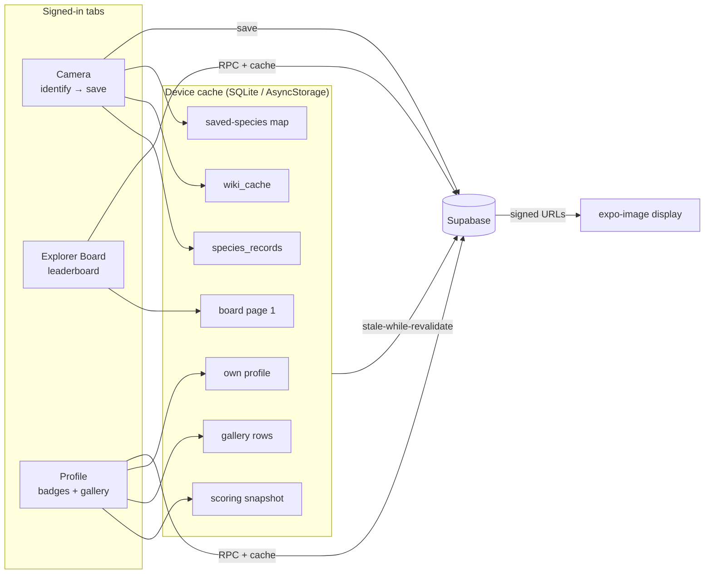
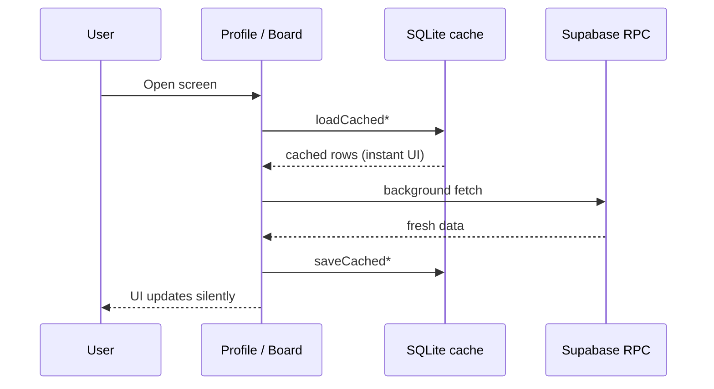
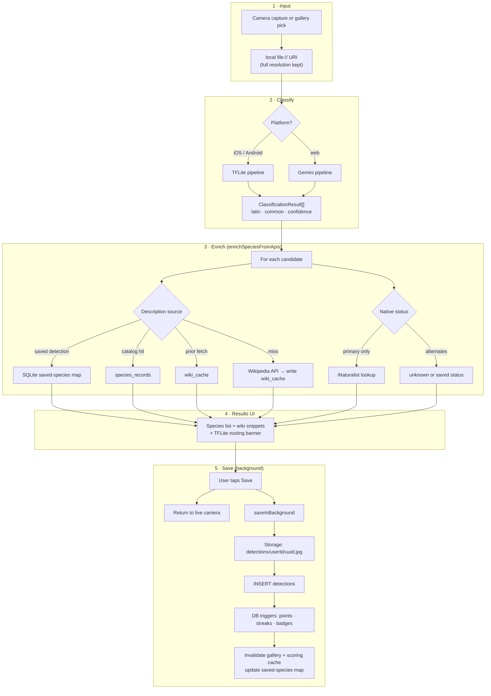
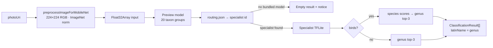
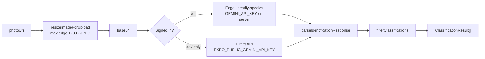
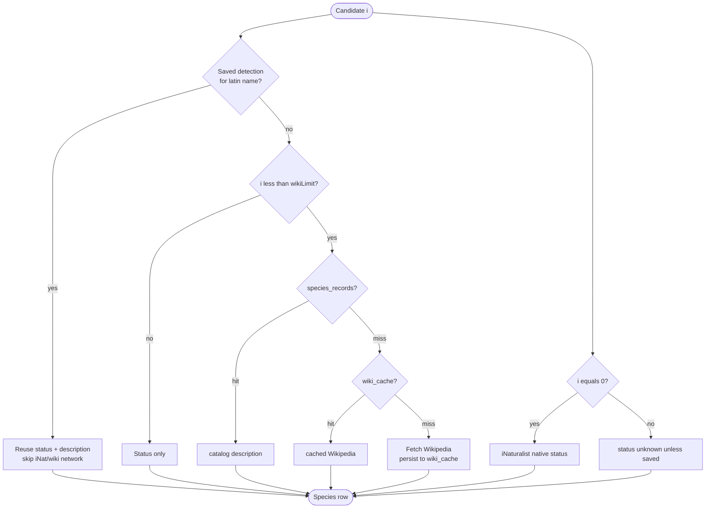
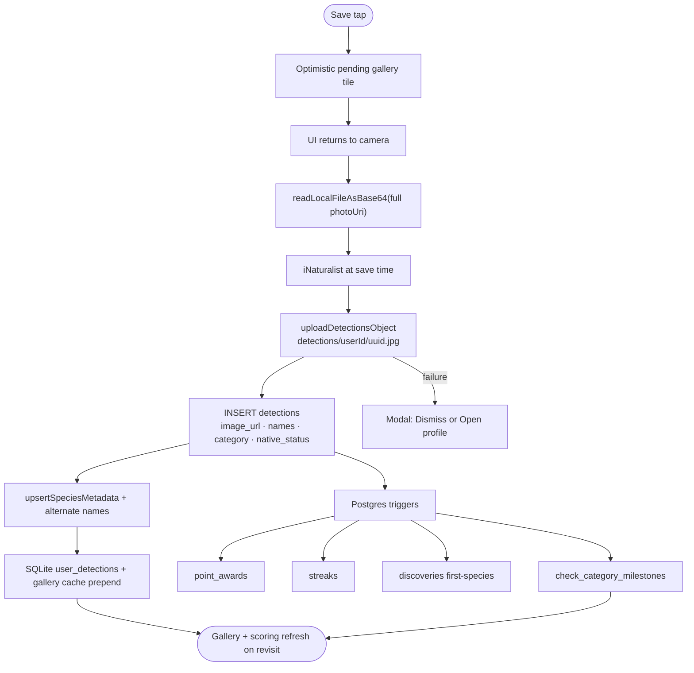
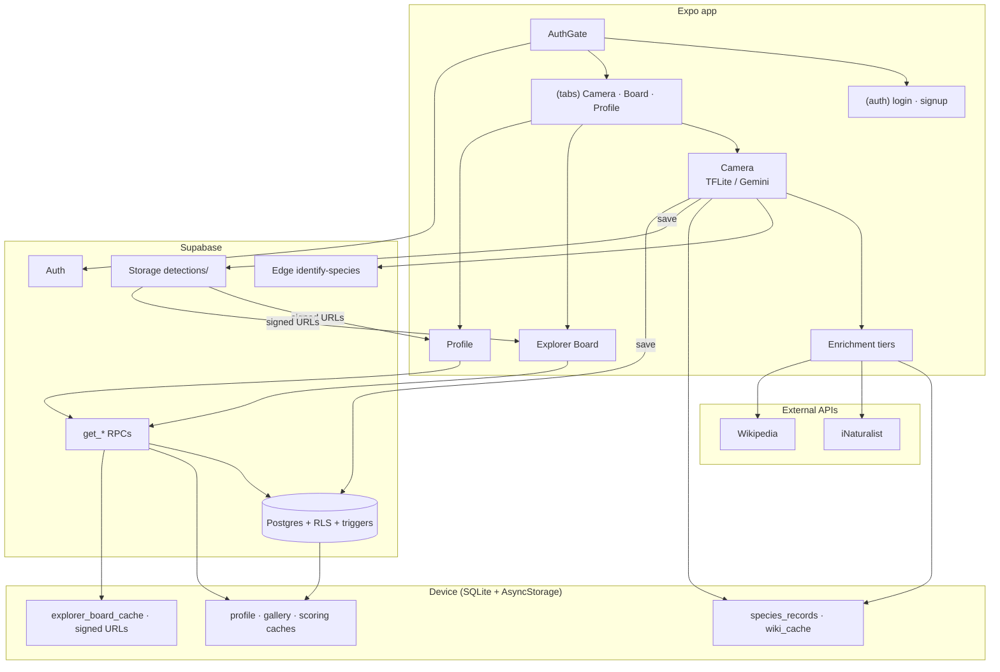

# Near Nature — architecture overview

Nature-identification app built with **Expo Router**, **Supabase** (Auth, Postgres, Storage, Edge Functions), and on-device caches so profile and gallery feel instant after the first load.

For SQL setup order, see [`sql/README.md`](../sql/README.md).

**Diagrams in this doc**

| Section | Covers |
|---------|--------|
| [Startup and routing](#startup-and-routing) | AuthGate, guest vs signed-in paths |
| [App flow](#app-flow-tabs-and-data) | Tabs, caches, stale-while-revalidate sequence |
| [Image pipeline](#image-pipeline-capture--identify--enrich--save) | Capture → classify → enrich → save (TFLite, Gemini, enrichment waterfall) |
| [System overview](#system-overview) | App ↔ Supabase ↔ device ↔ external APIs |

---

## High-level shape

| Layer | Role |
|--------|------|
| **UI** | Three tabs: Camera, Explorer Board, Profile (+ auth, public member profiles). No Discover explore tab. |
| **Auth** | Supabase Auth session in AsyncStorage; `AuthGate` routes signed-in users to tabs only if `public.users` exists |
| **Postgres** | Users, detections, discoveries, point awards, streaks — mostly via RPCs and RLS |
| **Storage** | Private `detections` bucket; images shown via **signed URLs** |
| **Edge** | `identify-species` — Gemini vision fallback (web / unsigned dev; not direct DB) |
| **External** | iNaturalist (native status), Wikipedia (descriptions) — only when needed |
| **Device cache** | Profile, gallery metadata, scoring snapshot, signed URLs, saved-species map, layout prefs |

---

## Startup and routing

`AuthGate` enforces this on every navigation. Password recovery can use `reset-password` without a full profile row.

**Post-login:** `usePostSignInNavigation` calls `router.replace` as a backup to `AuthGate`. Fresh sign-in sets `freshSignIn` → welcome modal once. `warmAuthUserCaches` runs after profile gate resolves.

**DB on startup:** `users` existence check, optional `ensure_public_user_profile` RPC. No gallery/scoring until those screens open.

---

## App flow (tabs and data)

**Stale-while-revalidate:** cached data paints immediately; a subtle header spinner shows during background refresh. Pull-to-refresh forces network.

---

## Image pipeline (capture → identify → enrich → save)

End-to-end path for a camera or gallery photo. **Full-resolution URI** is kept for save; classification uses a separate prepared image.

### TFLite path (native)

Bundled assets under `assets/tflite/near_nature_app_bundle/`.

| Stage | Model | Output |
|-------|--------|--------|
| Preview | `preview/preview_classifier.tflite` | Top taxon group (e.g. Bird, Butterfly) |
| Route | `routing.json` | Specialist folder or “no model” notice |
| Specialist | `inat2021_specialists/*/` | Top genus candidates (+ bird species rollup) |

### Gemini path (web fallback)

### Enrichment waterfall (per candidate)

Wiki description resolves in strict order; first hit wins. iNaturalist runs for **candidate 0 only** (unless saved data exists).

### Save pipeline (image bytes)

**DB during identify:** read-only from saved-species map, `species_records`, `wiki_cache`. **No write** until save.

### Camera tab — key modules

| Step | Primary modules |
|------|-----------------|
| Capture | `hooks/useCameraScreen.ts`, `hooks/usePickPhotoFromGallery.ts` |
| Classify (native) | `lib/camera/mobilenet/identifyPhotoWithTflite.ts`, `preprocessImageForMobileNet.ts` |
| Classify (web) | `hooks/useSpeciesIdentification.ts`, `api/gemini.ts`, Edge `identify-species` |
| Enrich | `lib/identification/enrichSpeciesFromApis.ts` |
| UI | `components/camera/camera-identification-panel.tsx` |
| Save | `hooks/useSaveDetection.ts`, `services/detectionService.ts` |

---

## Tab 2 — Explorer Board

- Loads paginated Explorer Board via RPC **`get_detection_count_leaderboard`**.
- **Device cache:** first page cached in SQLite (`explorer_board_cache`) or AsyncStorage on web — stale-while-revalidate on open; pull-to-refresh always hits the network.
- Search is **client-side** on loaded rows (280ms debounced).
- Member avatars/tiles use **signed URL** batch resolution (same pipeline as gallery).
- **FlashList** virtualizes list/grid inside parent scroll.
- Refresh on pull; `requestExplorerBoardRefresh()` after saves updates the board when revisited.
- Column count and list/grid layout preferences are cached locally (AsyncStorage).

---

## Tab 3 — Profile

Single scroll: collapsible identity → **Scoring & badges** (collapsed by default) → identification gallery.

### Scoring & badges (expand to load)

| Step | What happens |
|------|----------------|
| Collapsed | Section header only; snapshot hook not mounted |
| Expand | Read **scoring snapshot cache** → badge group grid (bonus / main / sub tiers) |
| Background | RPC **`get_user_scoring_snapshot`** (fallback: `get_user_score_by_category` + `point_awards`) |
| UI | One icon per discipline opens a popover of tier badges; dimmed = unearned |

Requires `sql/get_user_scoring_snapshot.sql` (or fallback RPCs) in Supabase.

### Gallery

| Step | What happens |
|------|----------------|
| Always visible | Below scoring section |
| Open / mount | **Gallery list cache** → instant grid |
| Toolbar | Category filter icon + grid-size menu + search (no section title) |
| Background | `detections` paginated SELECT → signed URLs → cache update |
| Delete | `DELETE detections` + invalidate gallery + scoring caches |

### Profile header

- Collapsible **username / motto / name / email / state** (editable motto & home state).
- **`useUser`:** cached `users` + **`get_public_user_profile`** RPC (stats).
- Pull-to-refresh: profile + gallery + scoring refetch.
- Avatar upload → Storage + `users` update.

---

## Public user profile (`/user/[userId]`)

- **`get_public_user_profile`** RPC + avatar / stats strip.
- **Badges** collapsible: **`get_public_user_awards`** — earned badges only (hidden if none).
- Gallery with `publicOnly` (non-sensitive detections).

---

## Device cache reference

| Cache | Key / location | Contents | Cleared on |
|-------|----------------|----------|------------|
| **Auth session** | Supabase → AsyncStorage | JWT / refresh | Sign out |
| **Own profile** | `near_nature:own_profile:{userId}` | User row + public stats | Sign out, account delete |
| **Gallery list** | `near_nature:gallery_list:{userId}:{publicOnly}` | Detection rows (no signed URLs) | Sign out, save, delete, force refetch |
| **Scoring snapshot** | `near_nature:scoring_snapshot:{userId}` | Mains, awards, score breakdown | Sign out, save, delete |
| **Signed URLs** | Memory + `near_nature:signed_url:{path}` | Supabase signed image URLs | Sign out (+ memory on expiry) |
| **Saved species session** | In-memory `Map` | Latest detection per latin name | Sign out; warmed on profile load |
| **Explorer Board list** | `near_nature:explorer_board_list` | First page of leaderboard rows | Never (global); overwritten on fetch |
| **Explorer Board columns** | AsyncStorage preference | 2/3/4 column grid | Never (UI pref) |
| **Gallery grid columns** | AsyncStorage preference | Column count | Never |
| **expo-image** | OS disk | Rendered bitmaps | OS-managed |
| **SQLite (`near_nature.db`)** | `expo-sqlite` on device | Global: `species_records`, `wiki_cache`, `explorer_board_cache`. User-scoped: profile, gallery list cache, scoring snapshot, saved-species map, signed URLs, **`user_detections`** | Sign out clears user-scoped SQLite rows; global catalog + board cache kept |

Stale-while-revalidate: show cache immediately, refresh in background when stale, then update cache. Device caches include `cachedAt`; entries younger than **15 minutes** skip background network unless pull-to-refresh or `force` refetch (save/delete still invalidates).

**SQLite notes:** Requires a native dev-client rebuild after installing `expo-sqlite` or adding migrations. Skipped on web (cache modules fall back to AsyncStorage). If SQLite init fails, a dismissible banner explains that caches fall back to network/AsyncStorage. Bundled genus catalog seeds on first launch or when the catalog version changes. On upgrade, legacy AsyncStorage cache keys are imported once into SQLite. **Sync model:** saves upload to Supabase then upsert locally; gallery/board/profile hooks show cached data immediately and refresh in the background.

**Implementation paths:**

- Local DB: `lib/db/initLocalDatabase.ts`, `context/LocalDatabaseContext.tsx`, `lib/db/speciesRepository.ts`, `lib/db/userCacheRepository.ts`, `lib/db/globalCacheRepository.ts`, `lib/db/detectionRepository.ts`
- Profile: `lib/profile/ownProfileCache.ts`, `hooks/useUser.ts`
- Gallery: `lib/detections/galleryListCache.ts`, `hooks/useUserDetectionGallery.ts`
- Explorer Board: `lib/explorerBoard/explorerBoardListCache.ts`, `hooks/useExplorerBoard.ts`
- Scoring: `lib/profile/scoringSnapshotCache.ts`, `hooks/useUserScoringSnapshot.ts`
- Signed URLs: `lib/detections/signedDetectionUrlCache.ts`, `signedDetectionUrlPersistentCache.ts`
- Saved species: `lib/identification/savedSpeciesSessionCache.ts`
- Sign-out local wipe: `lib/db/clearLocalUserDataOnSignOut.ts`

---

## When the database is called

| User action | Typical calls |
|-------------|----------------|
| Login / signup | Auth + `resolve_login_email` / availability RPCs |
| App open (signed in) | Session restore; profile row check |
| Open Profile | Cache hit → then `users` + `get_public_user_profile` |
| Open gallery (profile) | Cache → `detections` SELECT (paged) |
| Expand Scoring & badges | Cache → `get_user_scoring_snapshot` RPC |
| Identify photo (native) | On-device TFLite only (+ optional SQLite reads for enrichment) |
| Identify photo (web) | Edge `identify-species` or dev Gemini (+ optional SQLite reads for enrichment) |
| Save identification | Storage upload + `INSERT detections` (+ triggers) |
| Delete photo | `DELETE detections` + storage |
| Explorer Board | `get_detection_count_leaderboard` RPC (paged) |
| View other user | `get_public_user_profile` + `get_public_user_awards` + public gallery SELECT |
| Edit motto/state/avatar | `users` UPDATE (+ avatar storage) |

**Avoided on hot paths:** full `discoveries` scan for scoring UI, identification history until after save, redundant iNat for alternate species.

---

## Server-side logic (not called from app)

Postgres triggers on `detections` insert handle points, streaks, discoveries, and **`check_category_milestones`** (badges / tier awards using `subcategory` / `main_category`). The app reads results via `get_user_scoring_snapshot` and `point_awards`.

---

## System overview

High-level view of the app, backend, caches, and external APIs. For detail see **App flow** and **Image pipeline** above.

---

## Production checklist

1. Run SQL patches in order (`add_naturalist_*`, `create_point_awards`, `check_category_milestones`, `get_user_score_by_category`, `get_user_scoring_snapshot`, `get_public_user_awards`).
2. Reload Supabase schema cache (Settings → API).
3. `npm run verify:supabase`
4. Deploy `identify-species` edge function; set `GEMINI_API_KEY` in Supabase secrets (required for web identification).
5. Physical Android dev: `npm run start:dev` then `npm run android:install` (see `.env.example`).
6. Rebuild native app after native dependency changes (e.g. FlashList).

**Removed:** Discover explore tab and `sql/discover/*` catalog — not deployed. `public.discoveries` remains for first-species bonus + tier counts.
