# Near Nature — architecture overview

Nature-identification app built with **Expo Router**, **Supabase** (Auth, Postgres, Storage, Edge Functions), and on-device caches so profile and gallery feel instant after the first load.

For SQL setup order, see [`sql/README.md`](../sql/README.md).  
For local classifier model folder setup (non-committed binaries), see [`docs/LOCAL_MODEL_SETUP.md`](./LOCAL_MODEL_SETUP.md).

**Diagrams in this doc**

| Section | Covers |
|---------|--------|
| [Startup and routing](#startup-and-routing) | AuthGate, guest vs signed-in paths |
| [App flow](#app-flow-tabs-and-data) | Tabs, caches, stale-while-revalidate sequence |
| [Image inference](#image-inference) | Live preview, capture TFLite cascade, cloud Gemini fallback |
| [Image pipeline](#image-pipeline-capture--identify--enrich--save) | Capture → classify → enrich → save (enrichment waterfall, save) |
| [System overview](#system-overview) | App ↔ Supabase ↔ device ↔ external APIs |

---

## High-level shape

| Layer | Role |
|--------|------|
| **UI** | Three tabs: Camera, Explorer Board, Profile (+ auth, public member profiles). No Discover explore tab. |
| **Auth** | Supabase Auth session in AsyncStorage; `AuthGate` routes signed-in users to tabs only if `public.users` exists |
| **Postgres** | Users, detections, discoveries, point awards, streaks — mostly via RPCs and RLS |
| **Storage** | Private `detections` bucket; images shown via **signed URLs** |
| **Edge** | `identify-species` — Gemini vision fallback (web / unsigned dev; not direct DB) |
| **External** | iNaturalist (native status), Wikipedia (descriptions) — only on cache miss |
| **Device cache** | Profile, gallery metadata, scoring snapshot, signed URLs, saved-species map, layout prefs |

---

## Startup and routing

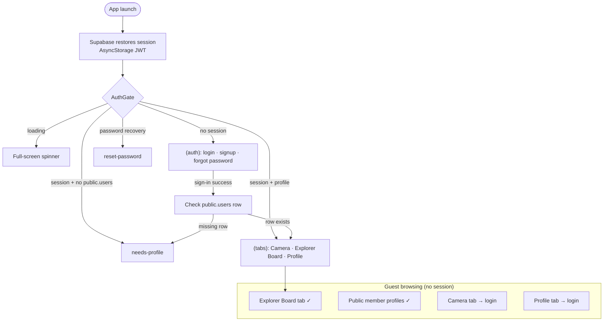

`AuthGate` enforces this on every navigation. Password recovery can use `reset-password` without a full profile row.

**Post-login:** `usePostSignInNavigation` calls `router.replace` as a backup to `AuthGate`. Fresh sign-in sets `freshSignIn` → welcome modal once. `warmAuthUserCaches` runs after profile gate resolves.

**DB on startup:** `users` existence check, optional `ensure_public_user_profile` RPC. No gallery/scoring until those screens open.

---

## App flow (tabs and data)

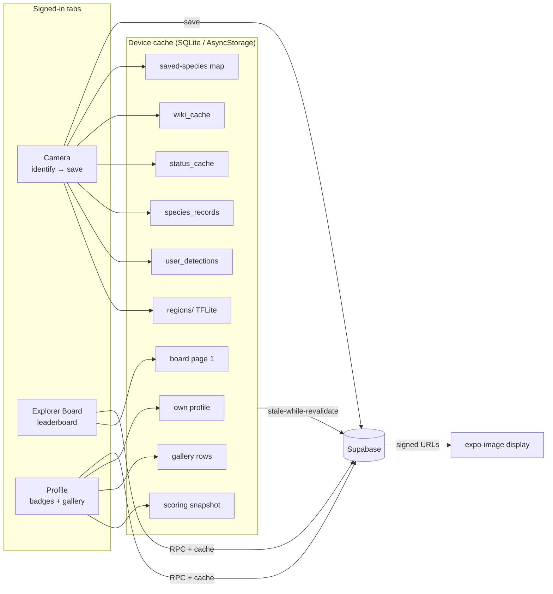

**Stale-while-revalidate** skips background network when `cachedAt` is fresh (15 minutes) — it does **not** prune on-disk rows. Eviction policy: [Local cache eviction & retention](#local-cache-eviction--retention).

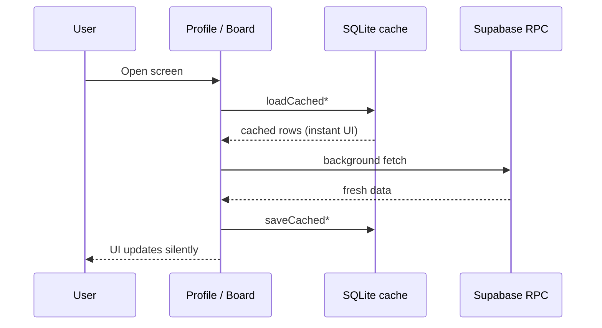

---

## Image inference

Near Nature runs **three separate inference paths**. Live preview and capture inference are independent; only capture/gallery results can be saved.

```mermaid
flowchart TB
  subgraph live["Live preview (camera viewfinder)"]
    Frames[Vision Camera frames] --> FP[Frame processor<br/>sampled · skipped]
    FP --> PrevModel{Preview model}
    PrevModel -->|scene_gate| SG[Plant/animal scene gate]
    PrevModel -->|kingdom| KD[Kingdom labels]
    PrevModel -->|routing_preview_v1| RP[Taxon-group hints]
    SG --> Overlay[On-screen label overlay]
    KD --> Overlay
    RP --> Overlay
  end

  subgraph capture["Capture / gallery inference (native)"]
    Photo[Still image URI] --> Prep[Resize · normalize<br/>224×224 RGB]
    Prep --> MV[MobileViT routing model]
    MV --> Route[routing.json + region pack]
    Route -->|specialist available| Spec[inat2021_specialists_v2 TFLite]
    Route -->|no model| Notice[Empty result + notice]
    Spec --> Top3[Top genus candidates<br/>+ confidence]
  end

  subgraph cloud["Cloud inference (web / fallback)"]
    WebPhoto[Still image URI] --> Resize[Max edge 1280 JPEG]
    Resize --> Gemini[Edge identify-species<br/>Gemini vision]
    Gemini --> Parsed[ClassificationResult list]
  end

  capture --> Enrich[Enrich + results UI]
  cloud --> Enrich
  live -.->|does not save| X[Not persisted]
```

### Inference modes compared

| Mode | When | Model(s) | Output | Persisted |
|------|------|----------|--------|-----------|
| **Live preview** | Camera tab, viewfinder on | Bundled `assets/tflite/preview_models/*` (scene gate, kingdom, routing preview) | Top label overlay; optional debug telemetry | No |
| **Capture TFLite** | After shutter or gallery pick (iOS/Android) | MobileViT routing → regional specialist `.tflite` | Up to 3 genus-level `ClassificationResult`s + routing meta | Yes, after Save |
| **Cloud Gemini** | Web platform, or when TFLite unavailable | Supabase Edge `identify-species` | Filtered species list from vision API | Yes, after Save |

### Capture TFLite cascade (detail)

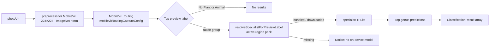

Regional specialist weights load from the **active region pack** (`lib/region/`, Supabase `region-models` bucket). Slim APK builds bundle **preview models only**; capture routing may resolve to a specialist that must be downloaded first.

#### Regional model distribution (v1 & scale path)

**Today (South / legacy `southeast` pack)**

| Piece | Implementation |
|-------|----------------|
| **Storage** | Public Supabase bucket `region-models` (`sql/storage_bucket_region_models.sql`) — **no separate CDN**; clients hit Supabase public object URLs |
| **Layout** | `{regionId}/manifest.json` + `{regionId}/inat2021_specialists_v2/**` (routing + ~12 specialist `.tflite` + labels) + optional `genus_info/` |
| **Publish** | `node scripts/upload-region-model-bundle.mjs <regionId> <version>` — builds manifest with per-file `sha256` + `sizeBytes`, uploads all objects (service role) |
| **Manifest** | `version`, `builtAt`, `minAppVersion`, `totalSizeBytes`, `files[]` with `path` / `storagePath` / hashes (`RegionModelManifest` in `services/regionModelDownloadService.ts`) |
| **Device path** | `documentDirectory/regions/{regionId}/` — written atomically after full download (`lib/region/downloadRegionModelBundle.ts`) |
| **Ready check** | `verifyRegionalModelBundleReady` — local `manifest.json` exists, every listed file present, **size matches** (sha256 not verified on device yet) |
| **Download trigger** | `RegionContext` → `ensureRegionalModels` on region change; skips network if local bundle passes ready check |

**Gaps before multi-region rollout**

1. **No stale-pack detection** — once a bundle is “ready”, the app does **not** re-fetch remote `manifest.json` to compare `version`. Publishing `2026.07.1` does not reach devices until the local bundle is incomplete or the user clears app data / switches region away and back after a forced invalidation.
2. **Full re-download only** — `downloadRegionModelBundle` always pulls every file in the manifest; no per-file diff against local `sha256` / incremental patch.
3. **No CDN cache layer** — every first-time (or full re-) download egresses from Supabase Storage origin; popular packs and retries scale linearly with bytes × unique client fetches.
4. **`minAppVersion` unused** — field exists in manifest; app does not gate download or show “update app” yet.

**Recommended scale path** (when Northeast / Midwest / West go live)

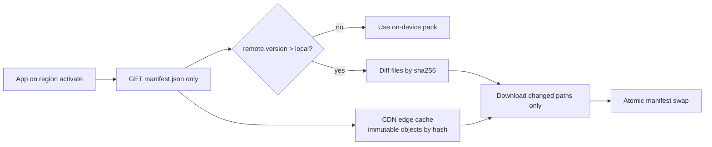

| Concern | v2 approach |
|---------|-------------|
| **Version check** | Background HEAD/fetch of remote manifest on app launch or region tab open; compare `version` (semver) or `builtAt` |
| **Incremental update** | Intersect `files[]` by `sha256`; download missing/changed paths; prune files not in new manifest |
| **CDN** | Front `region-models` with Cloudflare (or move blobs to R2 + CDN); cache `.tflite` with `Cache-Control: immutable` and path or query keyed by `sha256` |
| **Integrity** | Verify `sha256` after download (manifest already carries hashes from upload script) |
| **Cost model** | **Storage:** Σ(regions × pack MB). **Egress:** ≈ `(new installs + version bumps + region switches) × delta MB` — CDN cache hits drive repeat fetches toward zero. Rule of thumb: ~12 specialists × ~5–15 MB each ⇒ **~60–180 MB per full region pack**; 4 Census regions fully subscribed ⇒ worst-case **~240–720 MB once per device**, not per identify. Monitor Supabase Storage egress dashboard when DAU × active regions grows. |

**Modules:** `services/regionModelDownloadService.ts`, `lib/region/regionalModelBundle.ts`, `lib/region/regionPackLegacy.ts` (South ↔ `southeast` storage alias), `scripts/upload-region-model-bundle.mjs`.

### Live preview (detail)

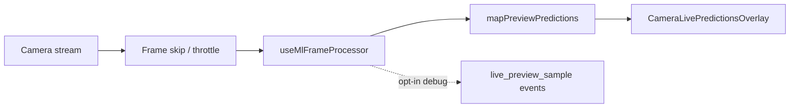

Preview is **suspended** during capture inference (`prepareMvpCaptureMemory`) to avoid loading two large models at once. User picks the preview model from camera top controls (AI menu).

### Key modules

| Path | Modules |
|------|---------|
| Live preview | `hooks/useLivePreviewFrameProcessor.ts`, `hooks/useMlFrameProcessor.ts`, `lib/camera/tflite/preview/` |
| Capture TFLite | `lib/camera/mobilenet/identifyPhotoWithTflite.ts`, `lib/camera/tflite/cachedModels.ts`, `lib/camera/mobilenet/tfliteRouting.ts` |
| Cloud | `hooks/useSpeciesIdentification.ts`, `api/gemini.ts`, Edge `identify-species` |
| Debug telemetry | `lib/classification/debug/` — `capture_identify`, `live_preview_sample`, optional TFLite vs Gemini comparison |

---

## Image pipeline (capture → identify → enrich → save)

End-to-end path for a camera or gallery photo. **Full-resolution URI** is kept for save; classification uses a separate prepared image.

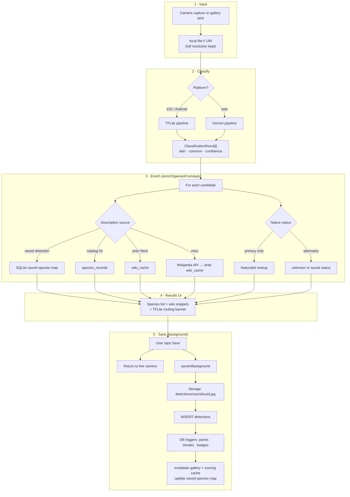

### TFLite path (native capture)

Bundled routing under `assets/tflite/`; regional specialists under downloaded region packs or `assets/tflite/near_nature_app_bundle/`.

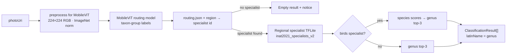

| Stage | Model | Output |
|-------|--------|--------|
| Routing | MobileViT (`mobilevitRoutingCaptureConfig`) | Top taxon group (e.g. Bird, Wildflowers) |
| Route | `routing.json` + active region | Specialist folder or “no model” notice |
| Specialist | `inat2021_specialists_v2/*/` (per region) | Top genus candidates (+ bird species rollup) |

### Gemini path (web fallback)

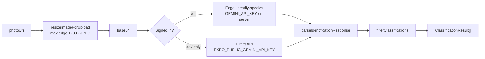

### Enrichment waterfall (per candidate)

Wiki description and native status each resolve in strict order; first hit wins. iNaturalist runs for **candidate 0 only** when status is not already known from saved data, catalog, or `status_cache`.

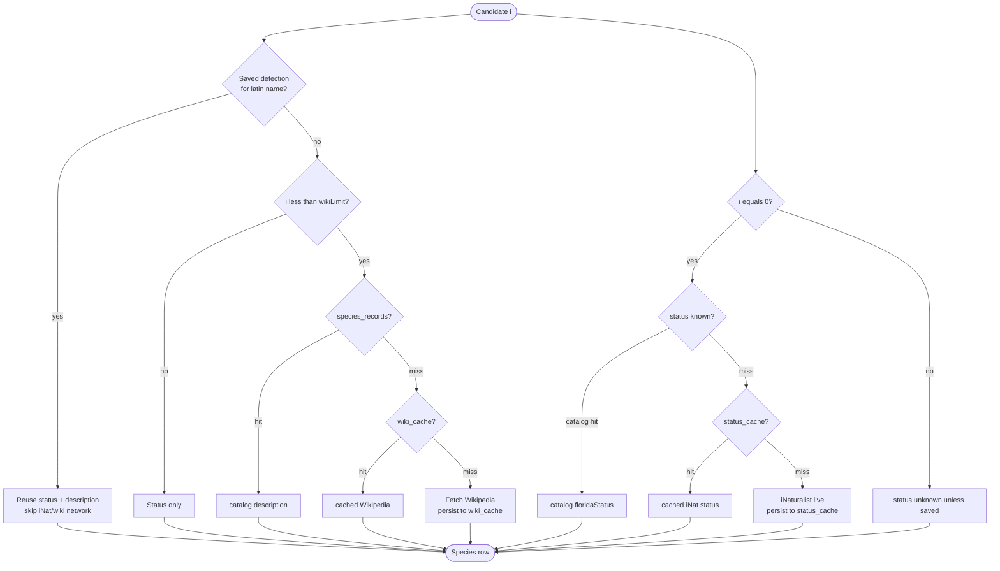

### Save pipeline (image bytes)

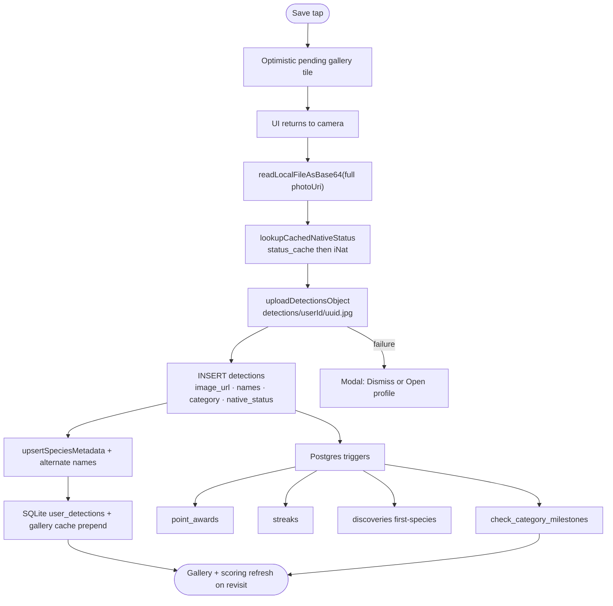

#### Trigger fan-out & scaling

Every `INSERT detections` runs this **synchronous** chain before the save RPC returns to the client:

| When | Trigger / function | Rows touched |
|------|-------------------|--------------|
| `BEFORE INSERT` | `set_detection_points` | NEW detection row only (base points from `native_status`) |
| `BEFORE INSERT` | `sync_detection_naturalist_categories` | NEW row (`subcategory` / `main_category`) |
| `BEFORE INSERT` | `sync_detection_search_fields` | NEW row (`search_vector` for gallery FTS) |
| `AFTER INSERT` | `on_detection_update_streak` → `update_streak()` | `streaks` — **one row per user** |
| `AFTER INSERT` | `on_detection_check_discovery` → `handle_first_discovery()` | On **first** `latin_name` for user: `INSERT discoveries`, `UPDATE` same detection (+5 bonus points), then `check_category_milestones(user_id)` |

`check_category_milestones` (not a separate trigger) re-scans **all** of the user’s `discoveries`, upserts every matching `user_badge_progress` row, and idempotently inserts into `point_awards` (`ON CONFLICT DO NOTHING`). Repeat saves of a species already in `discoveries` skip this path entirely.

**Contention today**

- Trigger writes are **scoped to the saving user** (`streaks`, `discoveries`, `user_badge_progress`, `point_awards`). Two different users saving at the same time do **not** lock the same scoring rows.
- **Explorer Board rank is not trigger-maintained.** `get_detection_count_leaderboard` aggregates `detections` at **read** time (`STABLE` RPC). There is no shared “leaderboard bucket” row updated on insert — so cross-user save races do not directly contend on rank materialization.
- The realistic hot spot is **one user, many concurrent first-discoveries** (rapid saves, retry storms): transactions serialize on `streaks.user_id` and may bulk-upsert the same `user_badge_progress` keys while `check_category_milestones` runs a full per-user aggregate.

**Fine at current scale** — the app typically saves one detection at a time per user; each trigger step is milliseconds.

**Watch signals:** rising `INSERT detections` p99; `pg_stat_activity` wait events on `streaks` or `user_badge_progress`; `check_category_milestones` showing up in slow-query logs.

**Future mitigations** (if needed): defer milestone evaluation to an async worker (`pg_notify`, queue, or scheduled job) so save returns after discovery + streak only; incremental milestone checks per `main_category` / `subcategory` instead of full re-aggregate; materialized leaderboard refreshed on a schedule if the read RPC becomes expensive (separate from write contention).

**DB during identify:** read from saved-species map, `species_records`, `status_cache`, `wiki_cache`. On external API miss, successful iNat/Wikipedia lookups are written back to `status_cache` / `wiki_cache` immediately (no detection row until save).

### Camera tab — key modules

| Step | Primary modules |
|------|-----------------|
| Capture | `hooks/useCameraScreen.ts`, `hooks/usePickPhotoFromGallery.ts` |
| Classify (native) | `lib/camera/mobilenet/identifyPhotoWithTflite.ts`, `lib/camera/tflite/cachedModels.ts` |
| Live preview (native) | `hooks/useLivePreviewFrameProcessor.ts`, `lib/camera/tflite/preview/previewModelRegistry.ts` — scene gate, kingdom, routing preview |
| Classify (web) | `hooks/useSpeciesIdentification.ts`, `api/gemini.ts`, Edge `identify-species` |
| Enrich | `lib/identification/enrichSpeciesFromApis.ts` — cached iNat for candidate 0; wiki capped to top N; saved / catalog / `status_cache` / `wiki_cache` tiers |
| UI | `components/camera/camera-identification-panel.tsx` |
| Save | `hooks/useSaveDetection.ts`, `services/detectionService.ts` |

---

## Tab 2 — Explorer Board

- Loads paginated Explorer Board via RPC **`get_detection_count_leaderboard(p_limit, p_offset)`**.
- **Device cache:** accumulated scroll pages cached in SQLite (`explorer_board_cache`, capped at 120 rows) — stale-while-revalidate on open; pull-to-refresh always hits the network.
- **Search (discovery lens):** when the search field is non-empty, the board switches to a community **photo grid** via **`search_public_detections(p_query, p_offset, p_limit)`** — same FTS/trigram matching as profile gallery search, across all public non-sensitive identifications. Tap a photo for details; **View member profile** opens their public profile. Empty search restores the leaderboard.
- Member avatars/tiles use **signed URL** batch resolution (same pipeline as gallery).
- **FlashList** virtualizes list/grid inside parent scroll (`drawDistance`, fixed row heights via `overrideItemLayout`).
- Refresh on pull; `requestExplorerBoardRefresh()` after saves updates the board when revisited.
- Column count and list/grid layout preferences are cached locally (AsyncStorage).
- Loading states use shared **`CenteredActivityIndicator`** with accessibility labels.

---

## Tab 3 — Profile

Single scroll: collapsible identity → **Scoring & badges** (collapsed by default) → identification gallery.

### Scoring & badges (expand to load)

| Step | What happens |
|------|----------------|
| Collapsed | Section header only; snapshot hook not mounted |
| Expand | Read **scoring snapshot cache** → badge group grid (bonus / main / sub tiers) |
| Background | RPC **`get_user_scoring_snapshot`** (fallback: `get_user_score_by_category` + `point_awards`) |
| UI | One icon per discipline opens a popover of tier badges; dimmed = unearned |

Requires `sql/get_user_scoring_snapshot.sql` (or fallback RPCs) in Supabase.

### Gallery

| Step | What happens |
|------|----------------|
| Always visible | Below scoring section |
| Open / mount | **Gallery list cache** → instant grid |
| Toolbar | Category filter icon + grid-size menu + search (no section title) |
| Background | `detections` paginated SELECT → signed URLs → cache update |
| Grid | Memoized tile rows in **FlashList** (`DetectionGalleryRow`, stable press handlers, `drawDistance`) |
| Delete | `DELETE detections` + invalidate gallery + scoring caches |

### Profile header

- Collapsible **username / motto / name / email / state** (editable motto & home state).
- **`useUser`:** cached `users` + **`get_public_user_profile`** RPC (stats).
- Pull-to-refresh: profile + gallery + scoring refetch.
- Avatar upload → Storage + `users` update.

---

## Public user profile (`/user/[userId]`)

- **`get_public_user_profile`** RPC + avatar / stats strip.
- **Badges** collapsible: **`get_public_user_awards`** — earned badges only (hidden if none).
- Gallery with `publicOnly` (non-sensitive detections).

---

## Device cache reference

| Cache | Key / location | Contents | Refresh / cap | Eviction today | Cleared on |
|-------|----------------|----------|---------------|----------------|------------|
| **Auth session** | Supabase → AsyncStorage | JWT / refresh | — | Supabase client | Sign out |
| **Own profile** | `user_profile_cache` / legacy key | User row + public stats | 15 min SWR | None | Sign out |
| **Gallery list** | `gallery_list_cache` | Loaded detection rows (metadata) | 15 min SWR | **None** — grows with scroll + prepends | Sign out, save prepend, delete, force refetch |
| **Scoring snapshot** | `scoring_snapshot_cache` | Mains, awards, breakdown | 15 min SWR | None | Sign out, save, delete |
| **Signed URLs** | Memory + `signed_url_cache` | Supabase signed image URLs | Per-URL `expires_at_ms` | **Lazy** — expired rows skipped on read, not purged | Sign out (full wipe) |
| **Saved species session** | In-memory `Map` | Latest detection per latin name | Session | None | Sign out |
| **Saved species SQLite** | `saved_species_cache` | Per-user latin → last description/status | — | **None** — one row per unique latin | Sign out |
| **Explorer Board list** | `explorer_board_cache` | Leaderboard rows | 15 min SWR | **Cap 120 rows** (`EXPLORER_BOARD_LIST_CACHE_MAX_ROWS`) | Never (global) |
| **Explorer Board columns** | AsyncStorage preference | 2/3/4 column grid | — | N/A (tiny) | Never |
| **Gallery grid columns** | AsyncStorage preference | Column count | — | N/A (tiny) | Never |
| **`wiki_cache`** | SQLite global | Wikipedia payloads by latin name | — | **None** — unbounded over years | Never |
| **`status_cache`** | SQLite global | iNat native status by latin + state | **90-day TTL** on read | **None** — expired rows linger until overwritten | Never |
| **`species_records`** | SQLite global | Genus catalog + enrichment | Version bump re-seed | Bounded ~catalog size; grows slowly via enrichment | Catalog version change |
| **`user_detections`** | SQLite user-scoped | Mirror of saved detection metadata | Sync on gallery fetch | **None** — one row per save | Sign out |
| **`regions/`** | `documentDirectory/regions/{id}/` | Downloaded TFLite packs | Manifest version (not checked yet) | **None** — old packs kept when switching region | Manual / reinstall |
| **expo-image** | OS disk | Rendered bitmaps | OS LRU | OS-managed | OS-managed |

Stale-while-revalidate: show cache immediately, refresh in background when stale, then update cache. Device caches include `cachedAt`; entries younger than **15 minutes** skip background network unless pull-to-refresh or `force` refetch (save/delete still invalidates). Explorer Board and gallery caches are not read while a search query is active.

### Local cache eviction & retention

**Not urgent at current scale**, but there is **no global pruning job** — a heavy user over a year could accumulate large `wiki_cache`, `user_detections`, and gallery JSON blobs on disk.

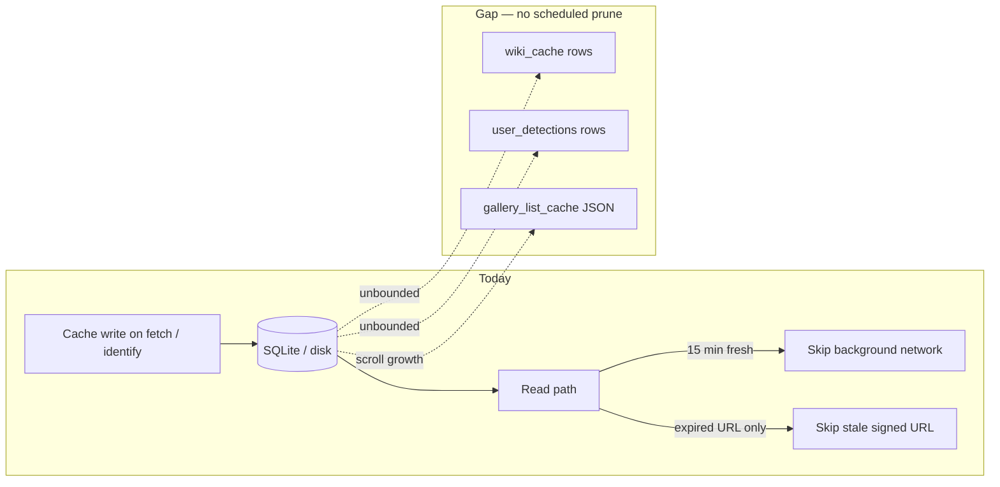

**Highest-risk unbounded stores**

| Store | Why it grows | Suggested cap (before support tickets) |
|-------|----------------|----------------------------------------|
| **`wiki_cache`** | Every new genus Wikipedia fetch on identify | LRU **500–1000** latin names, or purge `cached_at` older than **180 days** on app launch |
| **`user_detections`** | Every save upserts a row; gallery sync bulk-upserts pages | Optional **sync last N** (e.g. 500) if offline gallery is not a goal; else periodic trim of rows older than cloud-confirmed deletes |
| **`gallery_list_cache`** | Appends pages as user scrolls; prepends on save | Match Explorer Board — **cap ~120–200 rows** in JSON payload |
| **`status_cache`** | Every new latin+state iNat miss | TTL already 90d on read — add `DELETE WHERE cached_at < now() - interval` on launch |
| **`signed_url_cache`** | One row per distinct image path viewed | `DELETE WHERE expires_at_ms < now()` on launch (index exists) |
| **`regions/`** | Each visited Census region downloads full pack | Delete packs inactive **>30 days** or keep **max 2** regions on disk |

**Already bounded:** Explorer Board list (120 rows), `species_records` (~genus catalog), in-memory TFLite model cache (evicted on region switch), scoring/profile (single row per user).

**Sign-out** clears user-scoped SQLite + legacy AsyncStorage keys (`lib/db/clearLocalUserDataOnSignOut.ts`) but **keeps** global `wiki_cache`, `status_cache`, `species_records`, and `explorer_board_cache`.

**Implementation paths (eviction — not built yet):** `lib/db/wikiCacheRepository.ts`, `lib/db/statusCacheRepository.ts`, `lib/detections/galleryListCache.ts`, `lib/db/detectionRepository.ts`, `lib/region/deleteRegionModelBundle.ts`.

**UI tokens:** profile, gallery, and Explorer Board leaf components read **`authColors`** from `constants/auth-theme.ts` directly instead of drilling `mutedColor` / `borderColor` through screen props.

**SQLite notes:** Requires a native dev-client rebuild after installing `expo-sqlite` or adding migrations. Skipped on web (cache modules fall back to AsyncStorage). If SQLite init fails, a dismissible banner explains that caches fall back to network/AsyncStorage. Bundled genus catalog (`genus_profiles.enriched.min.json`) seeds `species_records` on first launch or when the catalog version changes — Metro logs `[db] species catalog seeded` in dev. On upgrade, legacy AsyncStorage cache keys are imported once into SQLite. **Sync model:** saves upload to Supabase then upsert locally; gallery/board/profile hooks show cached data immediately and refresh in the background.

**Module index:**

- Local DB: `lib/db/initLocalDatabase.ts`, `context/LocalDatabaseContext.tsx`, `lib/db/speciesRepository.ts`, `lib/db/userCacheRepository.ts`, `lib/db/globalCacheRepository.ts`, `lib/db/detectionRepository.ts`
- Profile: `lib/profile/ownProfileCache.ts`, `hooks/useUser.ts`
- Gallery: `lib/detections/galleryListCache.ts`, `hooks/useUserDetectionGallery.ts`
- Explorer Board: `lib/explorerBoard/explorerBoardListCache.ts`, `hooks/useExplorerBoard.ts`
- Scoring: `lib/profile/scoringSnapshotCache.ts`, `hooks/useUserScoringSnapshot.ts`
- Signed URLs: `lib/detections/signedDetectionUrlCache.ts`, `signedDetectionUrlPersistentCache.ts`
- Saved species: `lib/identification/savedSpeciesSessionCache.ts`
- Sign-out local wipe: `lib/db/clearLocalUserDataOnSignOut.ts`

---

## When the database is called

| User action | Typical calls |
|-------------|----------------|
| Login / signup | Auth + `resolve_login_email` / availability RPCs |
| App open (signed in) | Session restore; profile row check |
| Open Profile | Cache hit → then `users` + `get_public_user_profile` |
| Open gallery (profile) | Cache → `detections` SELECT (paged) |
| Expand Scoring & badges | Cache → `get_user_scoring_snapshot` RPC |
| Identify photo (native) | On-device TFLite only (+ optional SQLite reads for enrichment) |
| Identify photo (web) | Edge `identify-species` or dev Gemini (+ optional SQLite reads for enrichment) |
| Save identification | Storage upload + `INSERT detections` (+ triggers) |
| Delete photo | `DELETE detections` + storage |
| Explorer Board | `get_detection_count_leaderboard` RPC (paged) |
| View other user | `get_public_user_profile` + `get_public_user_awards` + public gallery SELECT |
| Edit motto/state/avatar | `users` UPDATE (+ avatar storage) |

**Avoided on hot paths:** full `discoveries` scan for scoring UI, identification history until after save, redundant iNat for alternate species.

---

## Server-side logic (not called from app)

Postgres triggers on `detections` insert handle points, streaks, discoveries, and (on first species only) **`check_category_milestones`** → `user_badge_progress` + `point_awards`. See [Trigger fan-out & scaling](#trigger-fan-out--scaling) for contention notes. The app reads results via `get_user_scoring_snapshot` and `point_awards`; Explorer Board rank is computed at read time, not on insert.

---

## System overview

High-level view of the app, backend, caches, and external APIs. For detail see **App flow** and **Image pipeline** above.

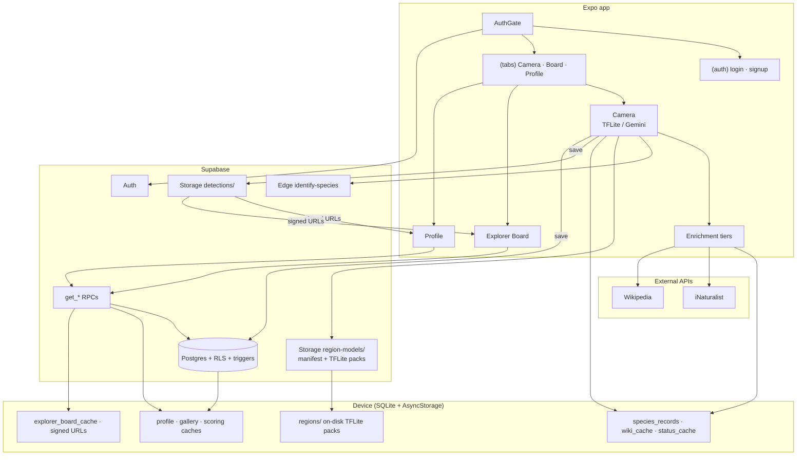

---

## Production checklist

1. Run SQL patches in order (`add_naturalist_*`, `create_point_awards`, `check_category_milestones`, `get_user_score_by_category`, `get_user_scoring_snapshot`, `get_public_user_awards`).
2. Reload Supabase schema cache (Settings → API).
3. `npm run verify:supabase`
4. Deploy `identify-species` edge function; set `GEMINI_API_KEY` in Supabase secrets (required for web identification).
5. Physical Android dev: `npm run start:dev` then `npm run android:install` (see `.env.example`).
6. Rebuild native app after native dependency changes (e.g. FlashList).

**Removed:** Discover explore tab and `sql/discover/*` catalog — not deployed. `public.discoveries` remains for first-species bonus + tier counts.
